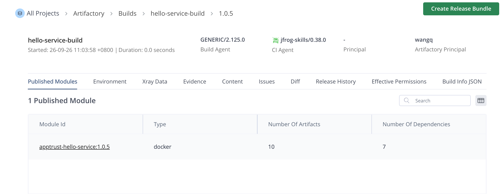
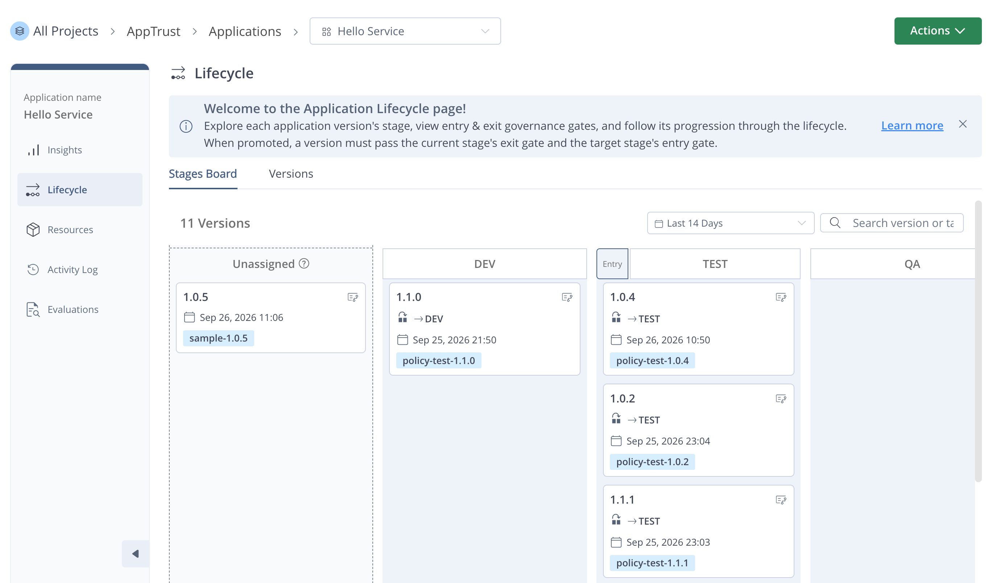
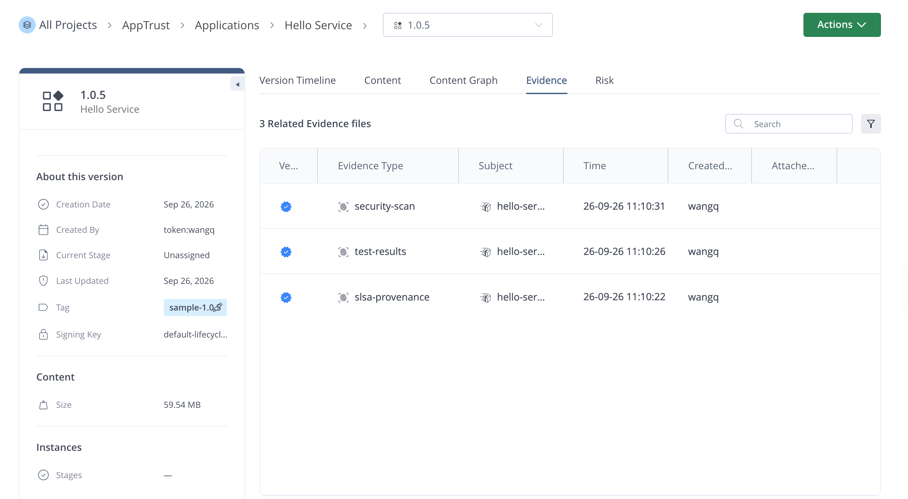
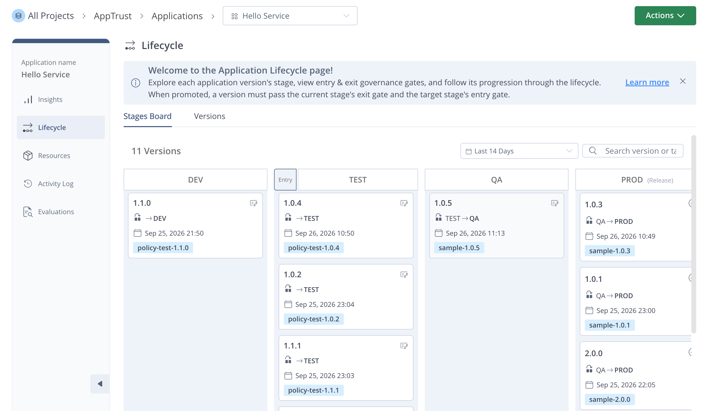
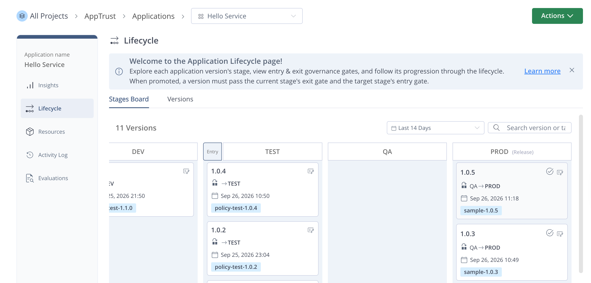
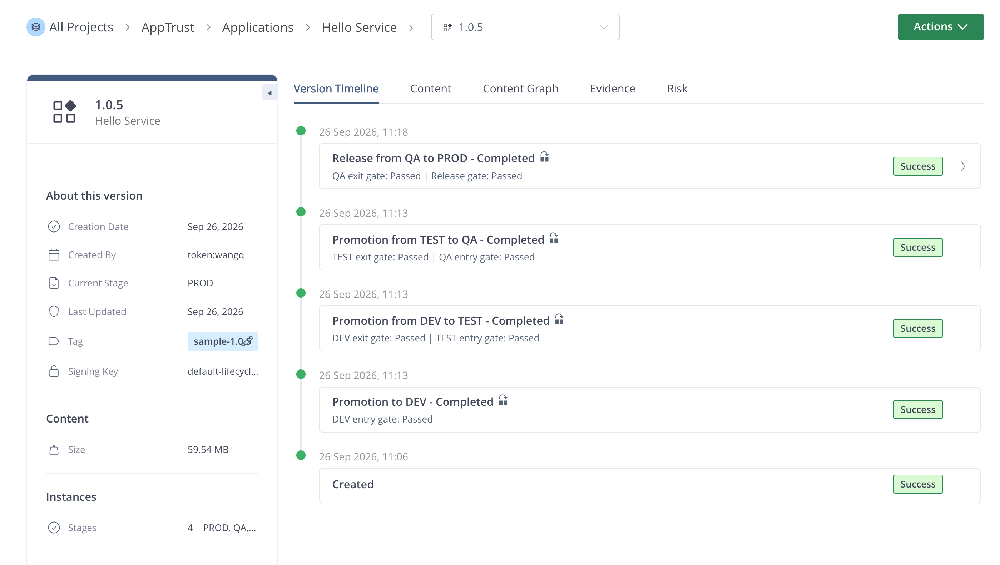
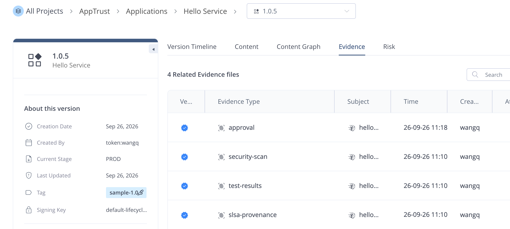
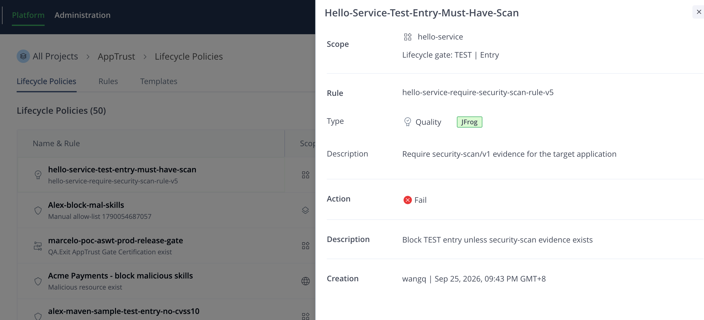
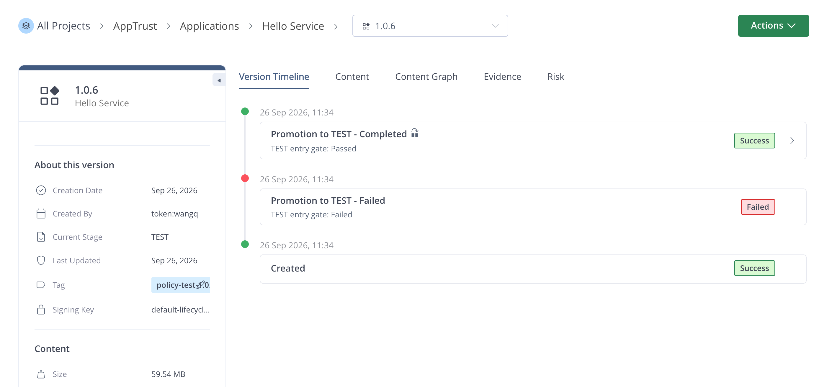

# AppTrust Sample — Full Lifecycle Demo

An end-to-end walkthrough of the JFrog AppTrust lifecycle:
**build → application version → evidence attachment → multi-stage promotion → final release**.

The sample application is a minimal nginx service (`hello-service`) that returns
JSON from `/` and `/healthz`. It is packaged as a Docker image, pushed to
Artifactory, sourced into an AppTrust application version, decorated with four
signed evidence records, and promoted stage by stage into PROD.

> References
> - AppTrust docs: https://jfrog.com/help/r/jfrog-platform-administration-documentation/apptrust
> - Evidence service: https://jfrog.com/help/r/jfrog-artifactory-documentation/evidence
> - CLI reference: `jf apptrust --help`, `jf evd --help`

---

## Directory layout

```
apptrust-sample/
├── Dockerfile                 # Pure nginx image; no Node runtime
├── nginx.conf                 # JSON responses for / and /healthz
├── evidence/                  # 5 Evidence Predicate templates
│   ├── slsa-provenance.json   # SLSA v1 provenance
│   ├── unit-tests.json        # Unit-test result summary
│   ├── security-scan.json     # Xray scan summary
│   ├── sonarqube-quality-gate.json # SonarQube quality gate result
│   └── qa-approval.json       # Manual QA sign-off
├── scripts/                   # Run in order for the full lifecycle
│   ├── config.sh              # Central config (override every value via env vars)
│   ├── 00-init.sh             # ping, create app, generate signing key pair
│   ├── 01-build.sh            # build/push image + publish JFrog build-info
│   ├── 02-create-version.sh   # AppTrust version-create from build
│   ├── 03-attach-evidence.sh  # attach SLSA + tests + Xray + SonarQube (4 records)
│   ├── 04-promote.sh          # promote DEV → QA
│   ├── 05-approve-and-release.sh # QA approval evidence → PROD → release
│   ├── 06-verify.sh           # verify evidence signatures + query promotion history
│   ├── 07-create-policy.sh    # Unified Policy that blocks TEST entry gate
│   ├── 07b-test-policy-block.sh # verify block-then-unblock behavior
│   ├── 99-cleanup.sh          # delete versions (optionally delete app)
│   └── run-all.sh             # runs the whole flow in order
└── .github/workflows/apptrust-pipeline.yml   # GitHub Actions example
```

---

## Prerequisites

| Item | Notes |
|---|---|
| `jf` CLI ≥ 2.100 | Needs both `jf apptrust` and `jf evd` |
| Docker | For building the image |
| `jq` | Validates Evidence Predicate JSON |
| **JFrog platform** with AppTrust + Evidence enabled | |
| **Access-token auth for AppTrust** | Basic auth is rejected — use `jf c add --access-token=...` or OIDC |
| **JFrog Project** | Must exist ahead of time (default: `alex`); DEV/TEST/QA/PROD stages/environments must be configured on the platform |
| **Docker repos** | One per stage, defaults follow `<project>-docker-<stage>-local` |

### One-time platform setup

In the JFrog UI:

1. **Create a Project** named `apptrust-demo` (override via the `JF_PROJECT` env var).
2. **Create three Docker local repos** and attach them to the project:
   - `apptrust-demo-docker-dev-local`
   - `apptrust-demo-docker-qa-local`
   - `apptrust-demo-docker-prod-local`
3. **Configure lifecycle stages** (Administration → AppTrust → Lifecycle):
   `DEV`, `QA`, `PROD`, and map each repo to the matching stage.

---

## Quickstart

### 1. Configure the server
```bash
jf c add my-apptrust \
  --url https://<your-tenant>.jfrog.io \
  --access-token <token> \
  --interactive=false
jf c use my-apptrust
```

### 2. (Optional) override defaults
```bash
export JF_SERVER_ID=solenglatest
export JF_PROJECT=alex
export APP_VERSION=1.0.0
export KEY_ALIAS=hello-service-evidence-key-v2
```

For the `solenglatest` demo environment used by this repository:

```bash
export JF_SERVER_ID=solenglatest
export JF_PROJECT=alex
export KEY_ALIAS=hello-service-evidence-key-v2
export APP_VERSION=2.0.0
export TEST_VERSION=2.0.1
```

`01-build.sh` detects the Docker daemon architecture automatically. Set
`DOCKER_PLATFORM` only when the demonstration requires a different target.

The Dockerfile uses the nginx image cached in
`solenglatest.jfrog.io/alex-docker/nginx:latest`. It does not install Node.

All overridable variables live in `scripts/config.sh`.

### 3. Run everything
```bash
cd apptrust-sample
./scripts/run-all.sh
```

Or step through it:

```bash
./scripts/00-init.sh              # bootstrap app + signing keys
./scripts/01-build.sh             # build & push image + publish build-info
./scripts/02-create-version.sh    # create AppTrust version (PRE_RELEASE)
./scripts/03-attach-evidence.sh   # attach provenance, test, and scan evidence
./scripts/04-promote.sh           # DEV → TEST → QA
./scripts/05-approve-and-release.sh  # QA approval → PROD → RELEASED
./scripts/06-verify.sh            # verify trusted key and released state
./scripts/07-create-policy.sh     # ensure the TEST entry security-scan policy
./scripts/07b-test-policy-block.sh # demonstrate block, attach evidence, retry
```

If the requested `APP_VERSION` tag already exists, `01-build.sh` increments the
SemVer patch component until it finds an available tag. It saves the selected
version in `.apptrust-version`; subsequent scripts read that file automatically.
`07b-test-policy-block.sh` also increments the `TEST_VERSION` patch component
when the requested application version already exists.

---

## Evidence types

Evidence is a verifiable, signed claim about a specific application version —
the SLSA supply-chain trust anchor. This sample covers five common predicates:

| Predicate Type | Purpose | When to attach |
|---|---|---|
| `https://slsa.dev/provenance/v1` | Records build source (git commit, runner, toolchain, base image) | After build completes |
| `https://jfrog.com/evidence/test-results/v1` | Unit / integration test summary | After tests pass |
| `https://jfrog.com/evidence/security-scan/v1` | Xray scan summary + policy verdict | After scan completes |
| `https://sonarsource.com/quality-gate/v1` | SonarQube quality gate and evaluated metrics | After SonarQube analysis completes |
| `https://jfrog.com/evidence/approval/v1` | Manual approval (QA, security, compliance) | Between stages |

All five are signed with the same ECDSA P-256 key (generated by
`jf evd generate-key-pair`). The default key alias is
`hello-service-evidence-key-v2`. The matching public key must be uploaded to the
platform's Trusted Keys, and the local private key must belong to that exact
public key.

---

## Lifecycle diagram

```
[git commit]
     │
     ▼
  docker build         ──► apptrust-demo-docker-dev-local
     │
     ▼
 jf rt build-publish
     │
     ▼                                     ┌──────────────────┐
 jf apptrust version-create ──► PRE_RELEASE│ Attach evidence:  │
     │                                     │  • SLSA           │
     │  ◄──────────────────────────────────┤  • Tests          │
     │                                     │  • Xray scan      │
     │                                     │  • SonarQube gate │
     ▼                                     └──────────────────┘
 promote DEV  ─► apptrust-demo-docker-dev-local  (promotion recorded)
     │
     ▼
 promote QA   ─► apptrust-demo-docker-qa-local
     │
     ▼
 Evidence: QA approval
     │
     ▼
 promote PROD ─► apptrust-demo-docker-prod-local
     │
     ▼
 jf apptrust version-release  ─► releaseStatus = RELEASED (immutable)
```

---

## Troubleshooting

**Q1: `jf apptrust ping` reports `does not support basic authentication`**

AppTrust only accepts access tokens. Reconfigure with `jf c add --access-token=...`
or `jf c edit`.

**Q2: `version-create` cannot find the build**

Confirm `jf rt build-publish` succeeded, and the `build-name` / `build-number`
you pass to `--source-type-builds` match exactly. Include `--project` on both
commands if the build lives under a project.

**Q3: Promotion fails because the stage does not exist**

Create the DEV/TEST/QA/PROD stages on the platform first (Administration → AppTrust
→ Lifecycle) and map each stage to its Docker repo.

**Q4: Evidence verification fails**

`00-init.sh` uploads the public key; it may take a few seconds to propagate.
If it still fails, check:
- `--key-alias` matches on both create and verify
- The private key file `.keys/evidence.key` has mode 600
- The Trusted Keys section lists `hello-service-evidence-key-v2`
- The local private key matches the public key stored under that alias; sharing
  an alias is insufficient when the key pair differs

**Q5: Cleanup**

```bash
DELETE_APPLICATION=true ./scripts/99-cleanup.sh
```

---

## CI/CD integration

See `.github/workflows/apptrust-pipeline.yml` — a full GitHub Actions example
with OIDC auth, Xray scan, evidence attachment, multi-stage promote, and a
`production` GitHub Environment as the PROD approval gate.

Required repo-level config:

- **Variables**: `JF_URL`, `JF_OIDC_PROVIDER`
- **Secrets**: `EVIDENCE_PRIVATE_KEY` (PEM contents of the signing private key)
- **Environments**: `production` (enable required reviewers to make it a real gate)

---

## Appendix: AppTrust 脚本执行记录

- 执行日期：2026-09-26
- JFrog Server ID：`solenglatest`
- Project：`alex`
- Application：`hello-service`
- Application Version：`1.0.5`

### 01 - 构建镜像并发布 Build Info

- 脚本：`scripts/01-build.sh`
- 结果：成功
- Docker 镜像：`solenglatest.jfrog.io/alex-docker-dev-local/apptrust-hello-service:1.0.5`
- Manifest digest：`sha256:64d629bb739db1315e6d337d246c2d55455a3b00830c92c3bad4efda7b80f78f`
- Build Info：`hello-service-build/1.0.5`



### 02 - 创建 Application Version

- 脚本：`scripts/02-create-version.sh`
- 结果：成功
- Application Version：`hello-service@1.0.5`
- 状态：`COMPLETED`
- Release 状态：`PRE_RELEASE`
- Tag：`sample-1.0.5`



### 03 - 附加签名证据

- 脚本：`scripts/03-attach-evidence.sh`
- 结果：成功
- SLSA provenance v1：已创建并验证
- Unit-test results：已创建并验证
- Xray security scan：已创建并验证



### 04 - 推进至 QA

- 脚本：`scripts/04-promote.sh`
- 结果：成功
- DEV entry gate：`pass`
- DEV → TEST：成功
- TEST entry gate：`pass`（应用 1 条策略）
- TEST → QA：成功
- 当前阶段：`QA`



### 05 - QA 审批并发布到 PROD

- 脚本：`scripts/05-approve-and-release.sh`
- 结果：成功
- QA approval evidence：已创建并验证
- QA exit gate：`pass`
- PROD release gate：`pass`
- QA → PROD：成功
- Release 状态：`RELEASED`



### 06 - 验证最终状态

- 脚本：`scripts/06-verify.sh`
- 结果：成功
- Trusted key：`hello-service-evidence-key-v2`
- Version：`1.0.5`
- Status：`COMPLETED`
- Release status：`RELEASED`
- Current stage：`PROD`




### 07 - 创建 TEST Entry Gate 策略

- 脚本：`scripts/07-create-policy.sh`
- 结果：成功
- Template：`hello-service-require-security-scan-v2`
- Template ID：`2103481999393652736`
- Rule：`hello-service-require-security-scan-rule-v5`
- Rule ID：`2103482163952975872`
- Policy：`hello-service-test-entry-must-have-scan`
- Policy ID：`2103480550460760064`
- Mode：`block`
- Gate：`TEST / entry_gate`



### 07b - 验证策略阻断与放行

- 脚本：`scripts/07b-test-policy-block.sh`
- 结果：成功
- 测试版本：`hello-service@1.0.6`
- 初始 evidence：未附加 security-scan evidence
- 首次 TEST entry gate：`fail`
- 违反策略：`hello-service-test-entry-must-have-scan`
- 附加 evidence：`https://jfrog.com/evidence/security-scan/v1`
- 重试 TEST entry gate：`pass`
- 最终阶段：`TEST`


