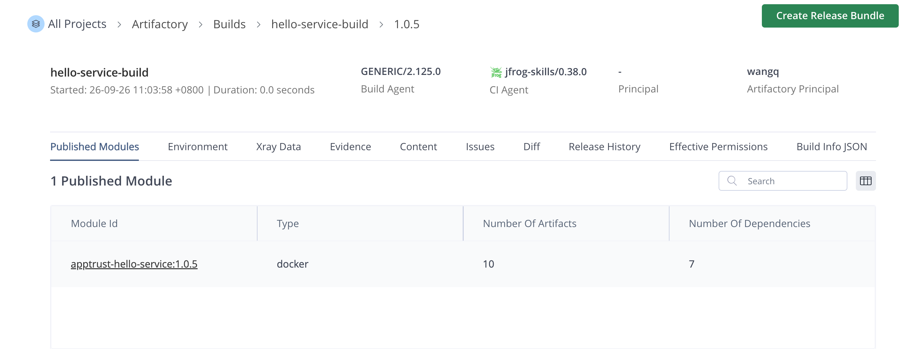
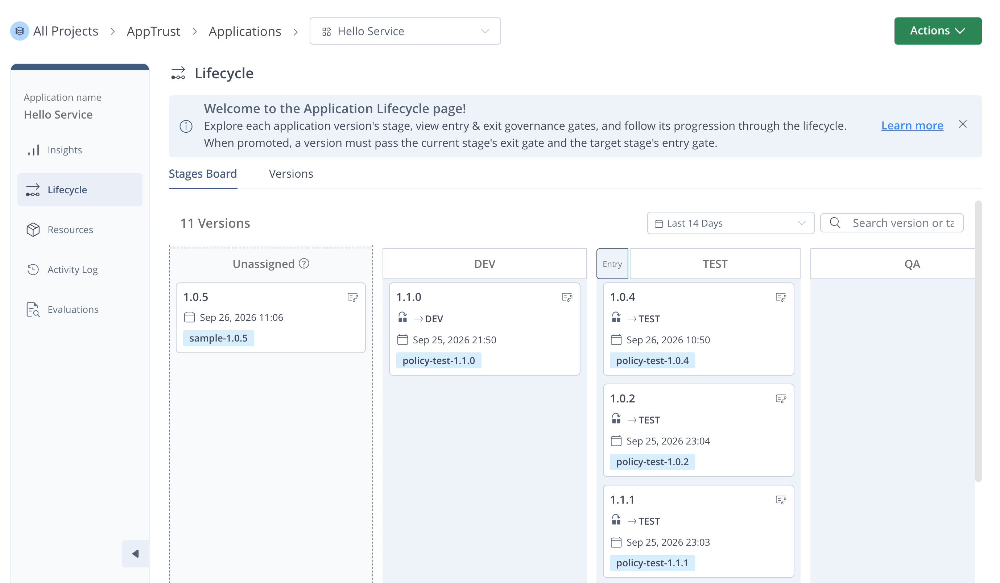
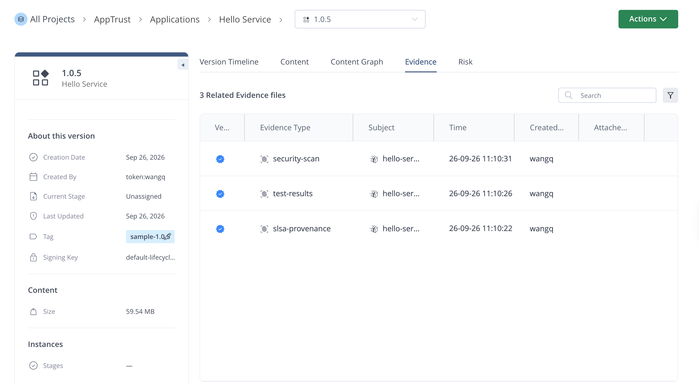
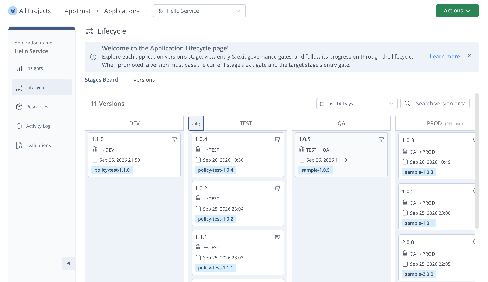
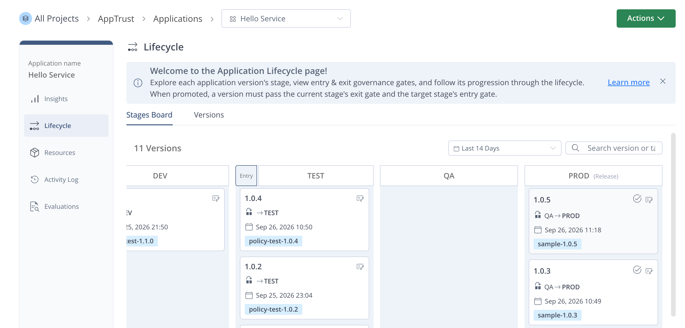
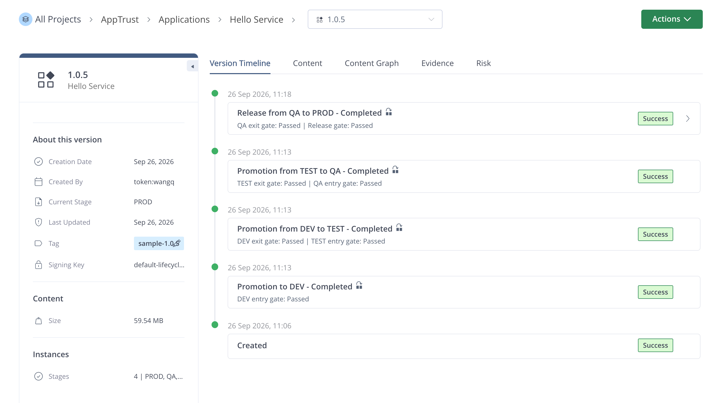
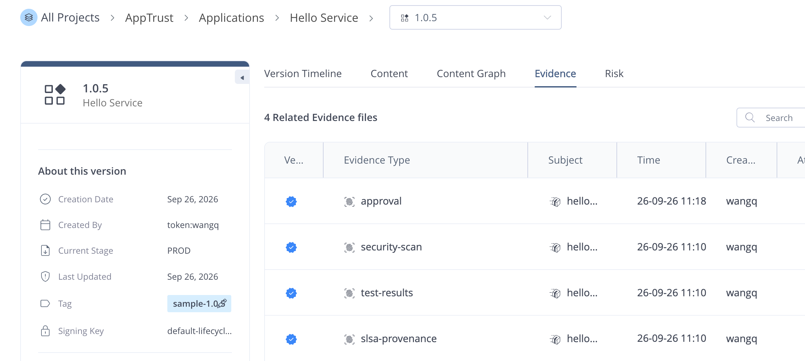
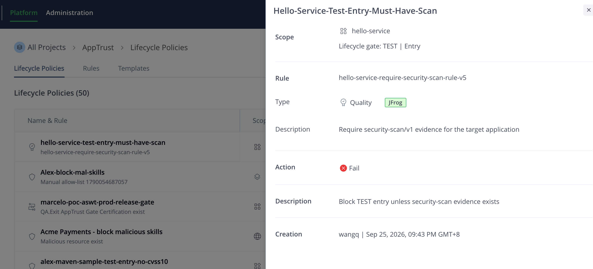
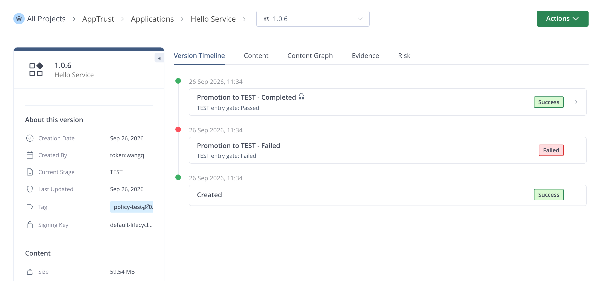

# AppTrust 脚本执行记录

- 执行日期：2026-09-26
- JFrog Server ID：`solenglatest`
- Project：`alex`
- Application：`hello-service`
- Application Version：`1.0.5`

## 01 - 构建镜像并发布 Build Info

- 脚本：`scripts/01-build.sh`
- 结果：成功
- Docker 镜像：`solenglatest.jfrog.io/alex-docker-dev-local/apptrust-hello-service:1.0.5`
- Manifest digest：`sha256:64d629bb739db1315e6d337d246c2d55455a3b00830c92c3bad4efda7b80f78f`
- Build Info：`hello-service-build/1.0.5`

## 02 - 创建 Application Version

- 脚本：`scripts/02-create-version.sh`
- 结果：成功
- Application Version：`hello-service@1.0.5`
- 状态：`COMPLETED`
- Release 状态：`PRE_RELEASE`
- Tag：`sample-1.0.5`

## 03 - 附加签名证据

- 脚本：`scripts/03-attach-evidence.sh`
- 结果：成功
- SLSA provenance v1：已创建并验证
- Unit-test results：已创建并验证
- Xray security scan：已创建并验证

## 04 - 推进至 QA

- 脚本：`scripts/04-promote.sh`
- 结果：成功
- DEV entry gate：`pass`
- DEV → TEST：成功
- TEST entry gate：`pass`（应用 1 条策略）
- TEST → QA：成功
- 当前阶段：`QA`

## 05 - QA 审批并发布到 PROD

- 脚本：`scripts/05-approve-and-release.sh`
- 结果：成功
- QA approval evidence：已创建并验证
- QA exit gate：`pass`
- PROD release gate：`pass`
- QA → PROD：成功
- Release 状态：`RELEASED`

## 06 - 验证最终状态

- 脚本：`scripts/06-verify.sh`
- 结果：成功
- Trusted key：`hello-service-evidence-key-v2`
- Version：`1.0.5`
- Status：`COMPLETED`
- Release status：`RELEASED`
- Current stage：`PROD`

## 07 - 创建 TEST Entry Gate 策略

- 脚本：`scripts/07-create-policy.sh`
- 结果：成功
- Template：`hello-service-require-security-scan-v2`
- Template ID：`2103481999393652736`
- Rule：`hello-service-require-security-scan-rule-v5`
- Rule ID：`2103482163952975872`
- Policy：`hello-service-test-entry-must-have-scan`
- Policy ID：`2103480550460760064`
- Mode：`block`
- Gate：`TEST / entry_gate`

## 07b - 验证策略阻断与放行

- 脚本：`scripts/07b-test-policy-block.sh`
- 结果：成功
- 测试版本：`hello-service@1.0.6`
- 初始 evidence：未附加 security-scan evidence
- 首次 TEST entry gate：`fail`
- 违反策略：`hello-service-test-entry-must-have-scan`
- 附加 evidence：`https://jfrog.com/evidence/security-scan/v1`
- 重试 TEST entry gate：`pass`
- 最终阶段：`TEST`

